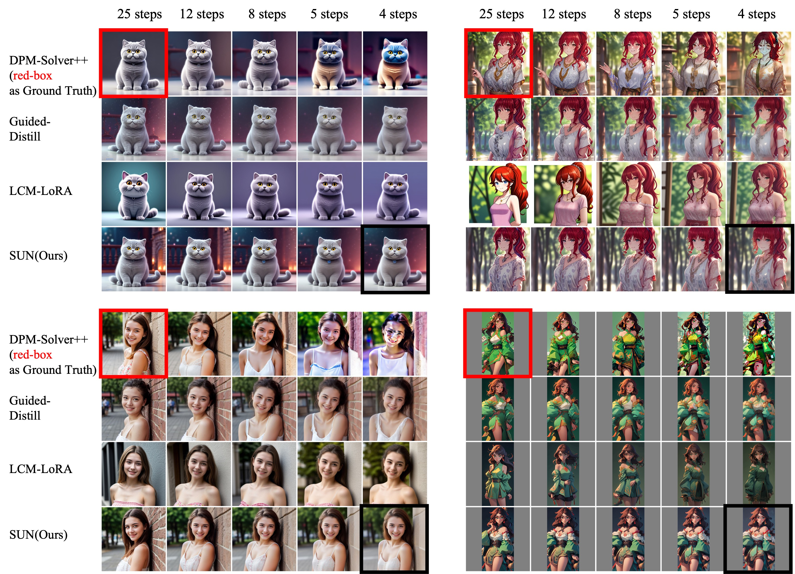
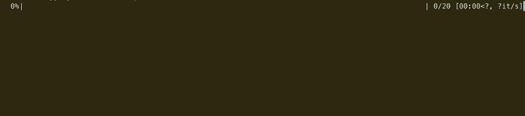
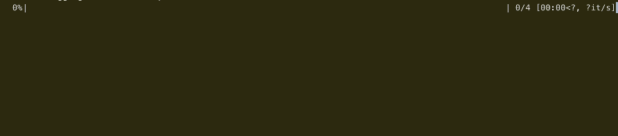

# speedup-plugin-for-stable-diffusions

This repo is the official implementation of SpeedUpNet(SUN) in PyTorch. 

Paper: [SpeedUpNet: A Plug-and-Play Hyper-Network for Accelerating Text-to-Image Diffusion Models](https://arxiv.org/pdf/2312.08887.pdf)

Project Page: [SpeedUpNet](https://williechai.github.io/speedup-plugin-for-stable-diffusions.github.io/)



## 10x speed up on stable diffusions
Introducing SUN as a plug-in, a pre-trained SD can generate high-quality images in only 4 steps. We can test on MacBook Pro(M1 Pro):

DPM-Solver++ 20 steps, 16 seconds (baseline)


+SUN, 4 steps, 2 seconds


See more on our [webpage](https://williechai.github.io/speedup-plugin-for-stable-diffusions.github.io/)

## Realtime Controllable Generation

SUN is compatible with controllable tools.
Real-time rendering can be achieved on high-end consumer-grade graphics cards. 


## Usage

```
cd demo

# prepare models

python controlnet_lora.py
```

## Download SUN adapter

https://huggingface.co/Williechai/SpeedUpNet/tree/main

## Update

**`2023.12.15`**: Readme.


## Citation
If you find this work is helpful in your research, please cite our work:
```
@misc{chai2023speedupnet,
      title={SpeedUpNet: A Plug-and-Play Hyper-Network for Accelerating Text-to-Image Diffusion Models}, 
      author={Weilong Chai and DanDan Zheng and Jiajiong Cao and Zhiquan Chen and Changbao Wang and Chenguang Ma},
      year={2023},
      eprint={2312.08887},
      archivePrefix={arXiv},
      primaryClass={cs.CV}
}
```

## Contact
If you have any questions, feel free to open an issue or directly contact me via: `weilong.cwl@antgroup.com`.
